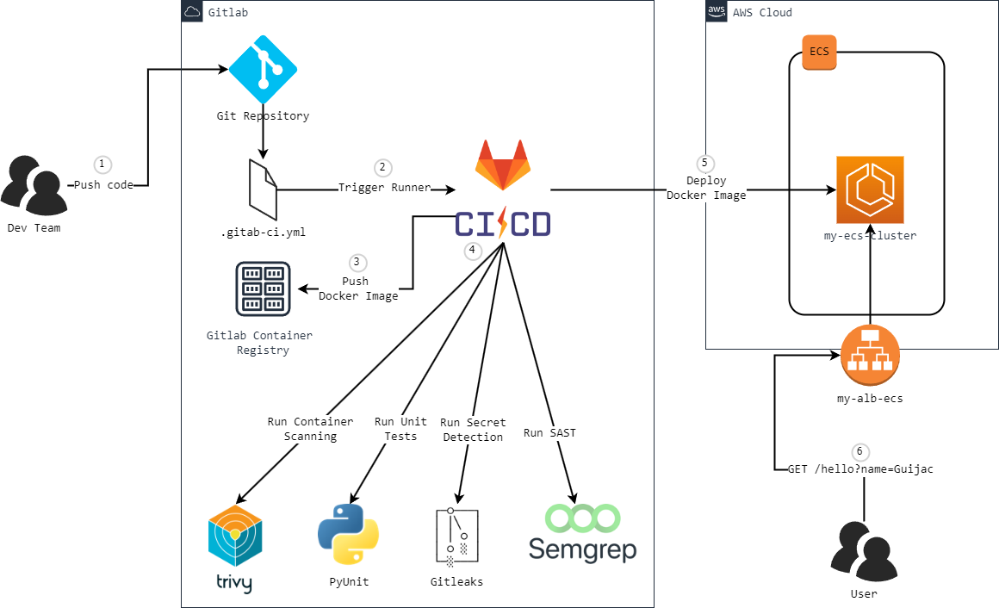

# Flask Gitlab-CI-Full-Pipeline



Modelo para uso do CI/CD do Gitlab em uma aplicação Python+Flask+uWSGI, realizando:

* [X] Build da imagem Docker no Gitlab Registry (3);
* [X] Escaneamento de Vulnerabilidades do Contêiner com Trivy (4);
* [X] Testes Unitários com PyUnit (4);
* [X] Detecção de Segredos com Gitleaks (4);
* [X] SAST com Semgrep (4);
* [X] Deploy no AWS ECS (5).

Para a execução da pipeline o arquivo .gitlab-ci.yml utiliza os templates disponíveis pelo Gitlab, sendo responsável apenas pela especificação dos testes unitários.

## Variáveis Configuradas no Gitlab

* AWS_ACCESS_KEY_ID
* AWS_SECRET_ACCESS_KEY
* AWS_SESSION_TOKEN
* AWS_DEFAULT_REGION
* CI_AWS_ECS_CLUSTER
* CI_AWS_ECS_SERVICE
* CI_AWS_ECS_TASK_DEFINITION

## Deploy local, com Docker

```
$ docker build --tag your-user/my-flask-app-ecs-full-pipeline .
```

## Testando

```
$ docker run -d -p 5000:5000 your-user/my-flask-app-ecs-full-pipeline
```

Saída esperada:

```
id-contêiner
$ curl localhost:5000/health-check

<h1>Hello From ECS! v6</h1>
```

## Executando testes unitários

```
$ python -m unittest -v tests/appTest.py
```

Saída esperada:

```
test_http_code_health_check (tests.appTest.AppTest.test_http_code_health_check) ... ok
test_http_code_hello_error (tests.appTest.AppTest.test_http_code_hello_error) ... {"time": "2024-05-22 09:24:49,724", "level": "ERROR", "message": {"event": "hello-error", "url": "http://localhost/hello", "user_agent": "Werkzeug/3.0.0", "error_message": "Nome n\u00e3o informado"}}
ok
test_print_health_check (tests.appTest.AppTest.test_print_health_check) ... ok
test_print_hello_error (tests.appTest.AppTest.test_print_hello_error) ... {"time": "2024-05-22 09:24:49,726", "level": "ERROR", "message": {"event": "hello-error", "url": "http://localhost/hello", "user_agent": "Werkzeug/3.0.0", "error_message": "Nome n\u00e3o informado"}}
ok
test_print_hello_success (tests.appTest.AppTest.test_print_hello_success) ... {"time": "2024-05-22 09:24:49,727", "level": "INFO", "message": {"event": "hello-success", "url": "http://localhost/hello?name=guijac", "user_agent": "Werkzeug/3.0.0", "nome": "guijac"}}
ok

----------------------------------------------------------------------
Ran 5 tests in 0.012s

OK
```

Baseado no projeto [Docker-Flask-uWSGI](https://github.com/cirolini/Docker-Flask-uWSGI/)
