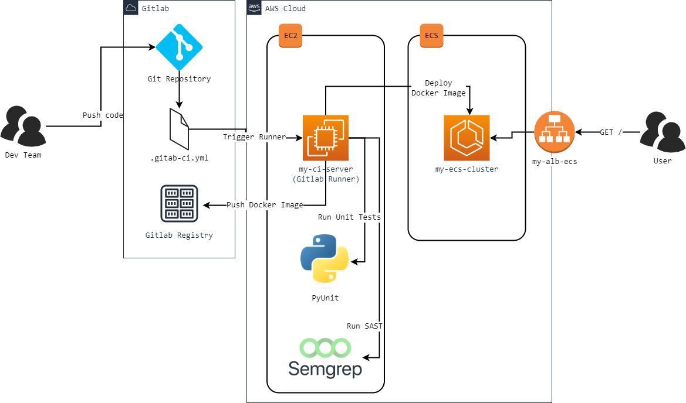

# Flask Gitlab-CI-Full-Pipeline



Modelo para uso do CI/CD do Gitlab em uma aplicação Python+Flask+uWSGI, realizando a execução dos seguintes stages:

1. Testes Unitários com PyUnit;
2. Build da imagem Docker no Gitlab Registry;
3. SAST com Semgrep;
4. Deploy no AWS ECS.

Para a execução da pipeline o Gitlab Runner foi [configurado em uma instância AWS EC2](https://docs.gitlab.com/runner/install/linux-repository.html), com Ubuntu.

## Variáveis Configuradas no Gitlab

* AWS_ACCESS_KEY_ID
* AWS_SECRET_ACCESS_KEY
* AWS_SESSION_TOKEN
* AWS_DEFAULT_REGION
* CI_AWS_ECS_CLUSTER
* CI_AWS_ECS_SERVICE
* CI_AWS_ECS_TASK_DEFINITION

## Deploy local, com Docker

```
$ docker build --tag your-user/my-flask-app-ecs-full-pipeline .
```

## Testando

```
$ docker run -d -p 5000:5000 your-user/my-flask-app-ecs-full-pipeline
```
Saída esperada:
```
id-contêiner
$ curl localhost:5000/health-check

<h1>Hello From ECS! v4</h1>
```

## Executando testes unitários

```
$ python -m unittest -v tests/appTest.py
```
Saída esperada:
```
test_http_code_health_check (tests.appTest.AppTest.test_http_code_health_check) ... ok
test_print_health_check (tests.appTest.AppTest.test_print_health_check) ... ok
test_print_hello_error (tests.appTest.AppTest.test_print_hello_error) ... {"time": "2023-05-08 17:44:28,035", "level": "ERROR", "message": {"event": "hello-error", "url": "http://localhost/hello", "user_agent": "werkzeug/2.2.2", "error_message": "Nome n\u00e3o informado"}}   
ok
test_print_hello_success (tests.appTest.AppTest.test_print_hello_success) ... {"time": "2023-05-08 17:44:28,038", "level": "INFO", "message": {"event": "heloo-success", "url": "http://localhost/hello?name=guijac", "user_agent": "werkzeug/2.2.2", "nome": "guijac"}}
ok

----------------------------------------------------------------------
Ran 4 tests in 0.045s

OK
```
Baseado no projeto [Docker-Flask-uWSGI](https://github.com/cirolini/Docker-Flask-uWSGI/)